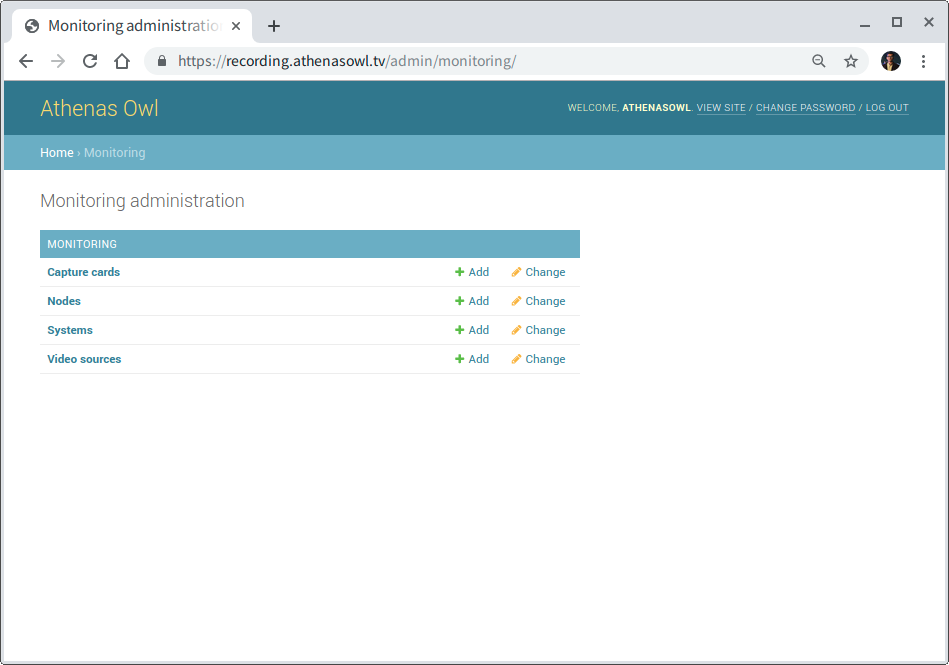
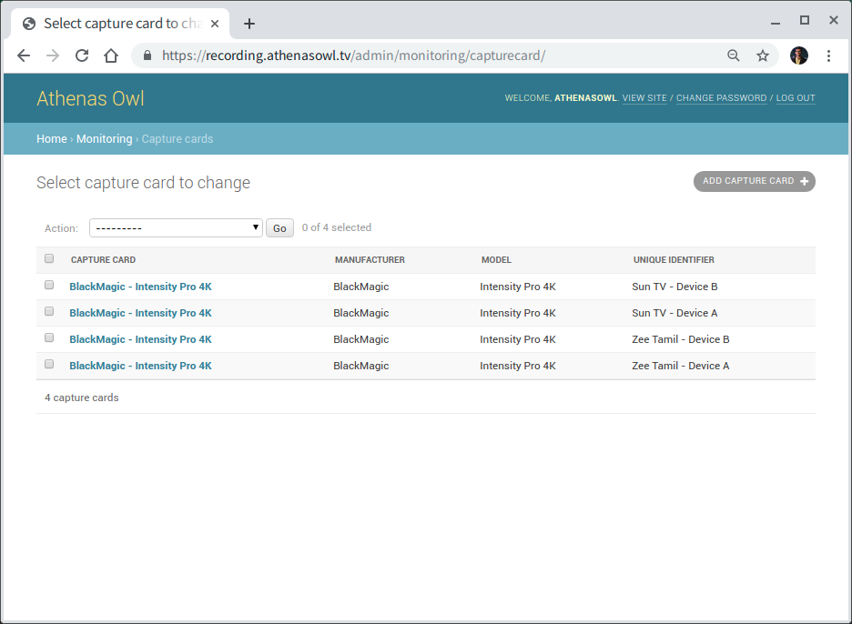
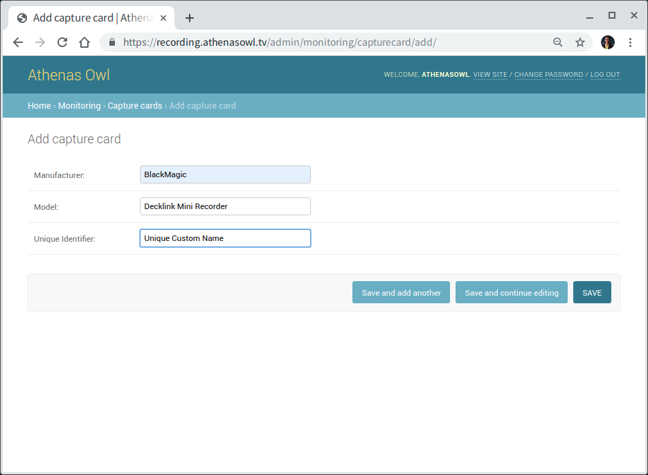
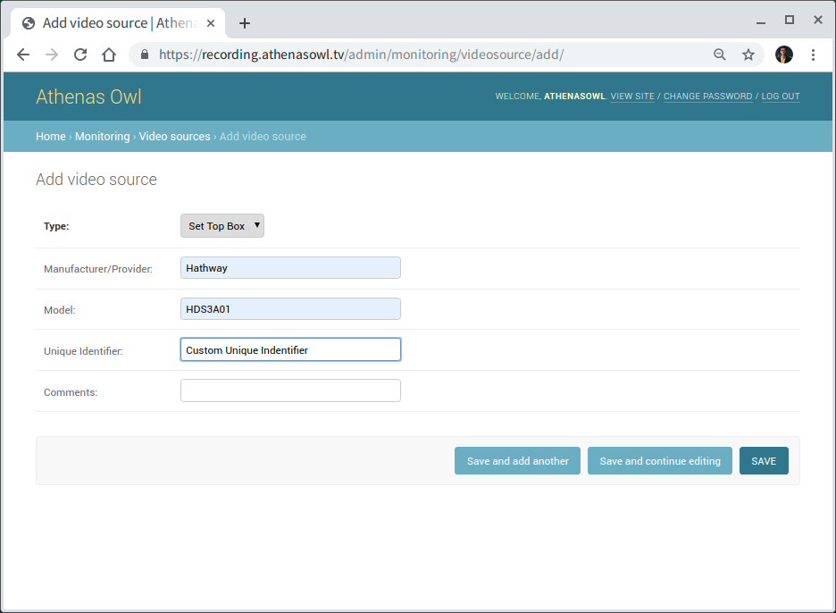
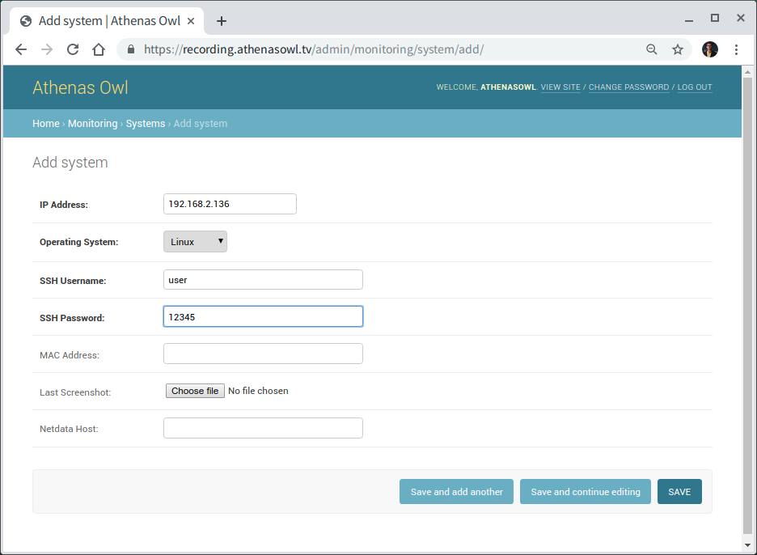
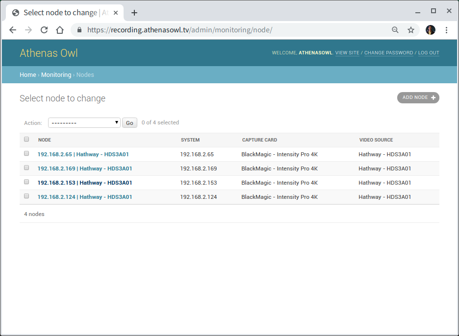
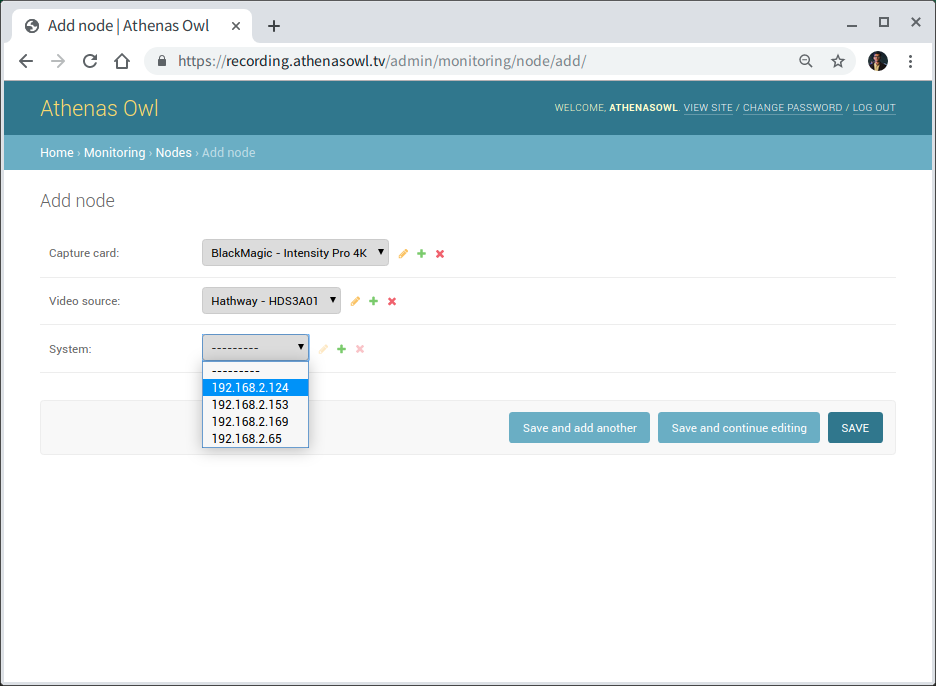

Onboarding New Node
===================

If a new recording device is added to the fleet of recording devices, it needs to be properly onboarded on the dashboard. Visit https://recording.athenasowl.tv/admin/monitoring/ and provide the necessary (and optional) configuration details of those devices to save that information in our version-controlled database.

    Fig. 1: Onboarding a new node by using the Monitoring Admin Interface.

Adding Node Details
--------------------
A node comprises of three individual components. The capture card, the video source and the PC itself. Each of these components reside as a separate entry in our database to enable thorough audit of related hardware issues if any.

    Fig. 2: List of Onboarded Capture Cards on Admin Interface.

Start by adding the details of connected Capture Card. Right now we are using either on of BlackMagic Intensity Pro 4K, or BlackMagic Decklink Mini Recorder. Hence, the manufacturer will be BlackMagic. Its ideal to put the S/N of the capture card in the Unique Identifier field.

    Fig. 3: Adding a new capture card.

The next component, Video Source can be similarly added. First, select the type of Video Source from *Set Top Box*, *Web Player* or *Other*. Fill up the fields for Manufacturer, Model and Unique Identifier.

    Fig. 4: Adding a new video source.

Finally, the details for the system needs to be added. It includes the IP Address, Operating System (Windows, Linux or MacOS), SSH Credentials (Username and Password) and MAC Address.
The Last Screenshot field stores the screenshot last captured on that system. Netdata Host is hostname to Netdata API endpoint for that System. If Netdata is installed, it usually is ``http://<ip_address>:19999``.
Our dashboard can act as a reverse proxy to redirect requests from ``https://recording.athenasowl.tv/monitoring/netdata/<ip_address>/`` to ``http://<ip_address>:19999``

    Fig. 5: Adding System details.

After all the sub-components of a Node have been added, its time to group them into under a single Node instance. This can be done under the Node admin Interface, as seen in Fig. 6.

    Fig. 6: The Node Admin Interface.

Select the entry for Capture Card, Video Source and System that make up the Node from the drop-down menus and press Save.

    Fig. 7: Selecting components of a Node.