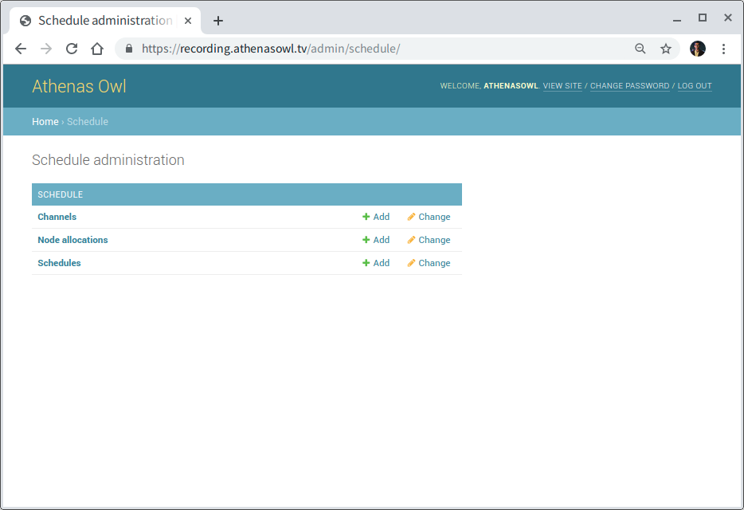

Configuring Recording Schedule and Assigning Node
=================================================

After adding the required **Nodes**, we need to assign them a Recording Schedule. A Schedule is a description of the time at which recording is supposed to start and stop for a particular channel.

    Fig. 1: The schedule admin interface.

To add and assign the **Schedule** to a **Node**, we will first add its corresponding channel on the admin interface.
