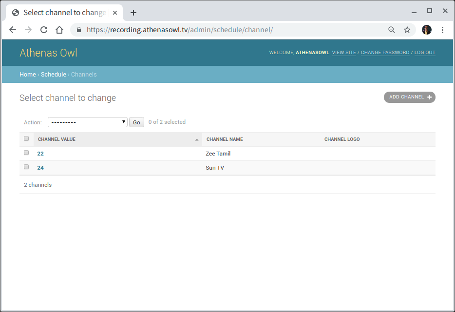
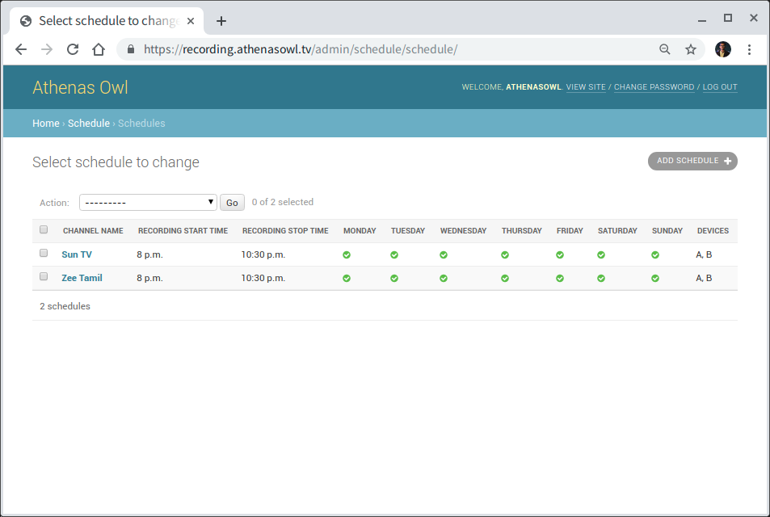
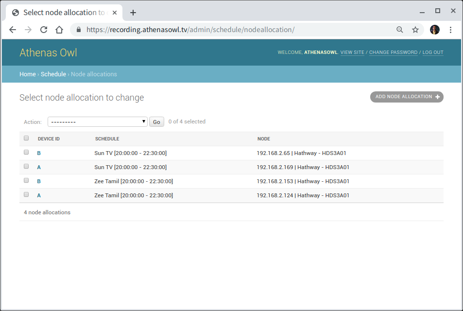

Configuring Recording Schedule and Assigning Node
=================================================

After adding the required **Nodes**, we need to assign them a Recording Schedule. A Schedule is a description of the time at which recording is supposed to start and stop for a particular channel. Visit https://recording.athenasowl.tv/admin/schedule/

..  figure:: _static/img/schedule_assignment/1_schedule_app.png

    Fig. 1: The schedule admin interface.

To add and assign the **Schedule** to a **Node**, we will first add its corresponding channel on the admin interface, which include the Channel Value and Channel Name. Channel logo field is optional.

    Fig. 2: Adding channel details on channel admin.

Next step is to add the Schedule at which that channel is supposed to be recorded. Insert values for start recording and stop recording times in 24 hour format, after selecting the channel. Optionally, select the weekdays if that's applicable.

    Fig. 3: Adding Channel Recording Schedule on admin interface.

Finally we need to allocate a Node to follow that Recording Schedule. That can be done via the Node Allocation page. Just select the schedule and Node, and mark the label as Device A/B/C.

    Fig. 4: Allocating a Node to Schedule.

This completes the TV Recording Node Onboarding Process.